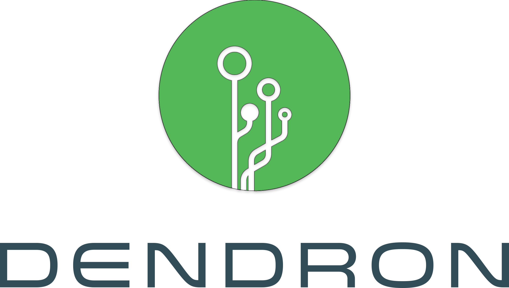

> [dendronhq/dendron](https://github.com/dendronhq/dendron): {{fm.desc}}

## Introduction

**Dendron**,[^1] or [Dendrite][], is a branched cytoplasmic process that extends from a nerve cell that propagates the electrochemical stimulation received from other neural cells to the cell body, or soma, of the neuron from which the dendrites project.

[dendrite]: <https://en.wikipedia.org/wiki/Dendrite>

[^1]: `δένδρον`, the Greek word for "tree".

## Reference

- [Dendron Home Page](https://wiki.dendron.so/)
- [Getting Started Guide](https://link.dendron.so/6b25)
- [Github](https://github.com/dendronhq/dendron)
